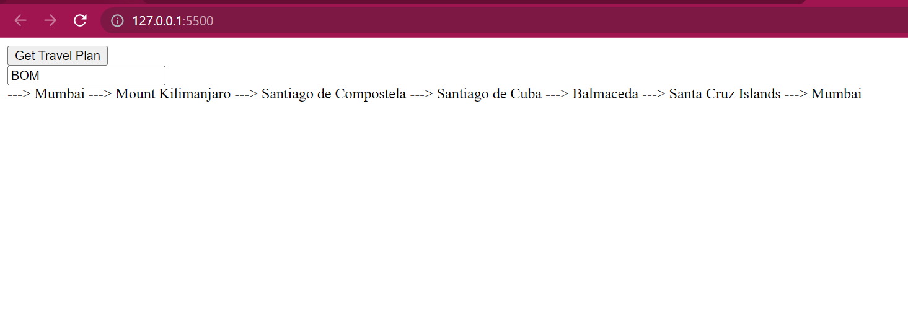

## Tech Stack
**Frontend**: Vanilla JavaScript

**Backend**: Python Flask

## Run the App

1. Download Python and Install flask: `pip3 install flask`
2. Run the backend server: `python get_shortest_distance.py`
3. To start Frontend download "Live Server" extension in VS code editor. Open `index.html` file. In bottom-right corner of VS code, click "Go Live" button. It will take you to the browser.
4. In browser, you will see a input text button. Type something `city ID` there and you will see corresponding travel plan.

## Enhancements required
1. The travel plan can be shown on a proper map.
2. In algorithm, I am finding sequence of continents to travel by looking which is the next nearest continent. But in the next continent, out of all cities the nearest city also needs to be find out.